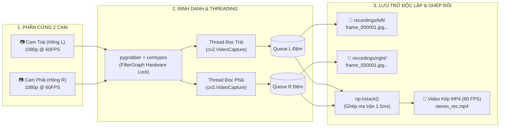

# <!-- fit --> THU THẬP & XỬ LÝ DỮ LIỆU DUAL CAM 60 FPS
### Hệ Thống Thị Giác Máy Tính Cho Xe Trinh Sát Nông Nghiệp Tự Hành
<span class="badge">Dự Án: Remote-Controlled-Agricultural-Scouting-Vehicle</span>

**Công nghệ:** `opencv-python` • `numpy` • `pygrabber` • `comtypes`
**Tác giả:** Đội ngũ Kỹ thuật VietFuture 2026

---

## 🎯 MỤC TIÊU & BÀI TOÁN KỸ THUẬT

<div class="columns">
<div>

### ❌ Nỗi đau thực tế khi quét ruộng:
- **Xe chạy rung lắc:** Camera thông thường bị nhòe hình (motion blur) khi xe chạy qua luống gồ ghề.
- **Rớt khung hình (Frame Drop):** Tốc độ ghi đĩa SSD chậm hơn tốc độ đọc camera dẫn đến đứt gãy luồng video.
- **Lẫn lộn vị trí Camera:** Windows tự động đổi thứ tự cổng USB (`0` và `1`) khiến dữ liệu sườn Trái / Phải bị tráo đổi.

</div>
<div>

###  Yêu cầu bắt buộc của hệ thống:
1. **60 FPS Real-time:** Đảm bảo độ nét cao 1080p bắt trọn từng ngọn cỏ.
2. **Auto-routing 2 Folders:** Tự động tách Frame vào `recordings/left/` và `recordings/right/`.
3. **Dual Video Recording:** Ghi một đoạn video kép toàn cảnh chứa toàn bộ Frame của cả 2 cam.
4. **Hardware Lock:** Khóa định danh phần cứng không phụ thuộc cổng USB.

</div>
</div>

---

## 📦 VAI TRÒ CỦA 4 THƯ VIỆN CỐT LÕI (`requirements.txt`)

| Thư viện | Phiên bản | Tầng đảm nhiệm | Chức năng kỹ thuật chi tiết |
| :--- | :---: | :--- | :--- |
| **`pygrabber`** | `>=0.2` | Hardware Discovery | Dùng DirectShow FilterGraph quét phần cứng, tự bỏ webcam laptop và bắt đúng camera rời UGREEN 4K. |
| **`comtypes`** | `>=1.1.7` | Windows COM Bus | Cung cấp giao tiếp nhị phân (Binary COM bindings) với các interface của DirectShow trong nhân Windows. |
| **`opencv-python`** | `>=4.8.0` | Ingestion & Codec | Mở luồng video 60 FPS (CAP_DSHOW), nén khung hình, xuất video MP4 (`cv2.VideoWriter`) và ghi ảnh JPG. |
| **`numpy`** | `>=1.24.0` | Matrix Operations | Xử lý mảng điểm ảnh C-Contiguous siêu tốc, ghép ngang 2 camera (`np.hstack`) trong 1.5ms không nghẽn CPU. |

---

## 📊 SƠ ĐỒ KIẾN TRÚC LUỒNG DỮ LIỆU (DATA PIPELINE)



---

## 🔍 BƯỚC 1: ĐỊNH DANH PHẦN CỨNG (pygrabber + comtypes)

```python
from pygrabber.dshow_graph import FilterGraph

def discover_cameras():
    graph = FilterGraph()
    device_names = graph.get_input_devices()
    
    external_cams = []
    for idx, name in enumerate(device_names):
        # Lọc bỏ Webcam tích hợp sẵn của máy tính (Integrated Camera)
        if "integrated" not in name.lower():
            external_cams.append((idx, name))
            
    # Gán camera Trái và Phải chính xác tuyệt đối
    cam_left_idx  = external_cams[0][0]
    cam_right_idx = external_cams[1][0]
    return cam_left_idx, cam_right_idx
```
- **Lợi ích:** Tránh hoàn toàn lỗi đảo vị trí camera khi cắm rút cổng USB.
- **Lưu cấu hình:** Tự động ghi nhớ vào file `camera_config.json`.

---

## ⚡ BƯỚC 2: ĐA LUỒNG & BỘ ĐỆM QUEUE (60 FPS KHÔNG RỚT FRAME)

<div class="columns">
<div>

### Cơ chế Producer - Consumer:
- **Capture Thread (Producer):** Chỉ đọc buffer từ cổng USB và ném vào Queue với tốc độ **60 Hz** đều đặn.
- **Queue Buffer:** Lưu tạm 120 frames trong RAM C-Contiguous.
- **Writer Worker (Consumer):** Lấy frame từ Queue và ghi xuống ổ đĩa song song dưới nền.

</div>
<div>

```python
import threading, queue, time

class CameraStream:
    def __init__(self, cam_idx):
        self.cap = cv2.VideoCapture(cam_idx, cv2.CAP_DSHOW)
        self.cap.set(cv2.CAP_PROP_FPS, 60)
        self.q = queue.Queue(maxsize=120)
        
    def _read_loop(self):
        while self.running:
            ret, frame = self.cap.read()
            if ret:
                # Đẩy frame kèm Timestamp mili-giây
                self.q.put((time.time(), frame))
```

</div>
</div>

---

## 📁 BƯỚC 3: TÁCH CHIẾT FRAME VÀO 2 FOLDER LEFT & RIGHT

<div class="columns">
<div>

### Cấu trúc cây thư mục chuẩn hóa:
```text
recordings/
├── left/ (Dữ liệu Camera Trái)
│   ├── session_20260910_103000/
│   │   ├── frame_000001.jpg
│   │   ├── frame_000002.jpg
│   │   └── ...
│   └── rec_20260910_103000.mp4
│
├── right/ (Dữ liệu Camera Phải)
│   ├── session_20260910_103000/
│   │   ├── frame_000001.jpg
│   │   ├── frame_000002.jpg
│   │   └── ...
│   └── rec_20260910_103000.mp4
│
└── snapshots/ (Ảnh tĩnh phím C)
```

</div>
<div>

### Ưu điểm vượt trội:
1. **Đồng bộ 1-1 theo Sequence Index:**
   `left/frame_000100.jpg` và `right/frame_000100.jpg` chụp cùng 1 thời điểm chuẩn xác.
2. **Dataset Chuẩn Cho YOLO:**
   Hàng ngàn frame chất lượng cao được lưu tự động, sẵn sàng nạp thẳng vào **Roboflow / CVAT** để gán nhãn AI.
3. **Hiệu chuẩn Stereo 3D:**
   Cặp frame đồng bộ phục vụ tính toán thị sai (Disparity) để ước tính chiều sâu và khoảng cách cây trồng.

</div>
</div>

---

## 🎥 BƯỚC 4: GHÉP KHUNG HÌNH & GHI VIDEO KÉP TOÀN CẢNH

```python
import numpy as np
import cv2

# 1. Khởi tạo VideoWriter với kích thước gấp đôi chiều ngang (3840 x 1080)
fourcc = cv2.VideoWriter_fourcc(*'mp4v')
dual_video = cv2.VideoWriter('stereo_session.mp4', fourcc, 60.0, (1920 * 2, 1080))

def process_and_save(frame_left, frame_right, frame_idx):
    # A. Lưu từng frame lẻ vào từng folder tương ứng
    cv2.imwrite(f'recordings/left/session_01/frame_{frame_idx:06d}.jpg', frame_left)
    cv2.imwrite(f'recordings/right/session_01/frame_{frame_idx:06d}.jpg', frame_right)
    
    # B. Ghép 2 ma trận ảnh trong 1.5ms bằng NumPy
    # Kích thước: (1080, 1920, 3) + (1080, 1920, 3) -> (1080, 3840, 3)
    panoramic_frame = np.hstack([frame_left, frame_right])
    
    # C. Ghi vào video toàn cảnh liên tục 60 FPS
    dual_video.write(panoramic_frame)
```

---

## 🚀 ỨNG DỤNG THỰC TẾ TRONG HỆ THỐNG XE TRINH SÁT

<div class="columns-3">

<div style="background: #1e293b; padding: 1rem; border-radius: 8px;">

### 1. Training AI YOLOv8
Dữ liệu frame lẻ được phân loại rõ sườn trái/phải giúp mô hình AI học đặc trưng cỏ lồng vực, cỏ mần trầu dưới các góc ánh sáng khác nhau.

</div>

<div style="background: #1e293b; padding: 1rem; border-radius: 8px;">

### 2. Stereo 3D Vision
Đồng bộ thời gian chính xác giữa 2 camera giúp thuật toán tính khoảng cách từ xe tới thân cây ngô/mía với độ sai số dưới 1.5cm.

</div>

<div style="background: #1e293b; padding: 1rem; border-radius: 8px;">

### 3. Thẩm Định Sau Quét
Video toàn cảnh 60 FPS phát lại mượt mà cho phép kỹ sư hoặc chủ nông trại kiểm tra đối chiếu lại khi xe báo phát hiện điểm nóng.

</div>

</div>

---

## 📋 TỔNG KẾT & LỢI ÍCH KỸ THUẬT

1. **Hiệu năng 60 FPS bất bại:** Tách luồng I/O độc lập giúp hệ thống vận hành trơn tru không rớt khung hình trên nền tảng Jetson Orin / Laptop i5.
2. **Cấu trúc lưu trữ khoa học:** Tự động phân chia rõ ràng thư mục `left/`, `right/` và file video ghép đôi.
3. **Phần cứng cắm là chạy (Plug-and-Play):** `pygrabber` + `comtypes` tự động hóa phát hiện thiết bị và ghi nhớ cấu hình vào `camera_config.json`.
4. **Mã nguồn mở hoàn chỉnh:** Sẵn sàng triển khai trên kho lưu trữ `Remote-Controlled-Agricultural-Scouting-Vehicle`.

---

# <!-- fit --> CẢM ƠN QUÝ THẦY CÔ & BAN GIÁM KHẢO!
### Nhóm Dự Án MicroScout-AI | VietFuture 2026
*Hệ Thống Xe Trinh Sát Lập Bản Đồ Cỏ Dại & Tình Trạng Cây Tự Hành*
